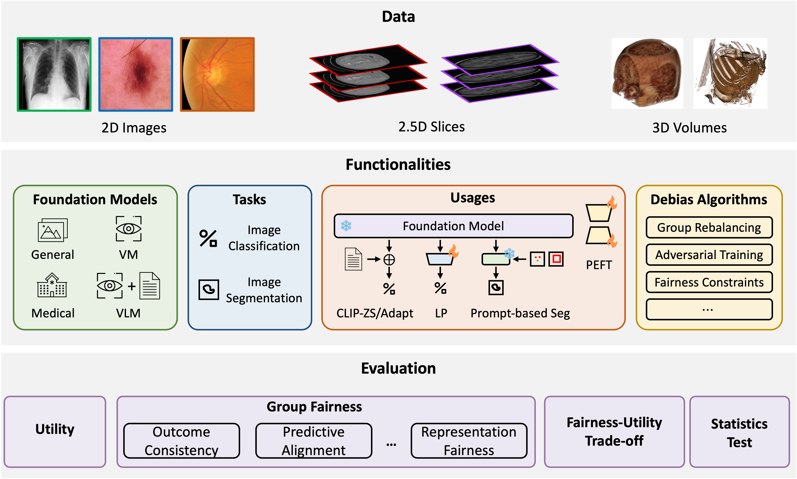
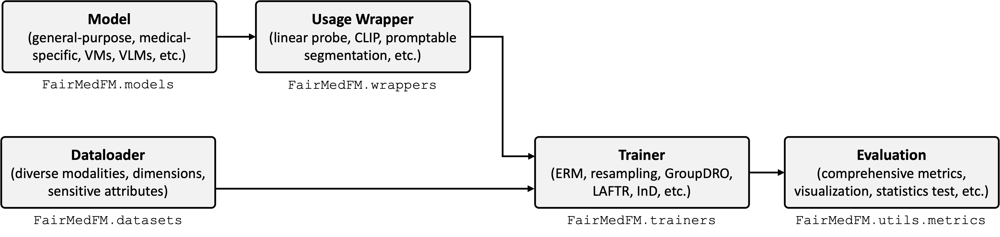

# <div align =center> FairMedFM
## <div align =center> Fairness Benchmarking for Medical Imaging Foundation Models


## Abstract
The advent of foundation models (FMs) in healthcare offers unprecedented opportunities to enhance medical diagnostics through automated classification and segmentation tasks. However, these models also raise significant concerns about their fairness, especially when applied to diverse and underrepresented populations in healthcare applications. Currently, there is a lack of comprehensive benchmarks, standardized pipelines, and easily adaptable libraries to evaluate and understand the fairness performance of FMs in medical imaging, leading to considerable challenges in formulating and implementing solutions that ensure equitable outcomes across diverse patient populations. To fill this gap, we introduce FairMedFM, a fairness benchmark for FM research in medical imaging. FairMedFM integrates with 17 popular medical imaging datasets, encompassing different modalities, dimensionalities, and sensitive attributes. It explores 20 widely used FMs, with various usages such as zero-shot learning, linear probing, parameter-efficient fine-tuning, and prompting in various downstream tasks -- classification and segmentation. Our exhaustive analysis evaluates the fairness performance over different evaluation metrics from multiple perspectives, revealing the existence of bias, varied utility-fairness trade-offs on different FMs, consistent disparities on the same datasets regardless FMs, and limited effectiveness of existing unfairness mitigation methods. 

## Structure

FairMedFM captures comprehensive modules for benchmarking the fairness of foundation models in medical image analysis.



- **Dataloader**: provides a consistent interface for loading and processing imaging data across various modalities and dimensions, supporting both classification and segmentation tasks.
- **Model**: a one-stop library that includes implementations of the most popular pre-trained foundation models for medical image analysis.
- **Usage Wrapper**: encapsulates foundation models for various use cases and tasks, including linear probe, zero-shot inference, PEFT, promptable segmentation, etc.
- **Trainer**: offers a unified workflow for fine-tuning and testing wrapped models, and includes state-of-the-art unfairness mitigation algorithms.
- **Evaluation** includes a set of metrics and tools to visualize and analyze fairness across different tasks.

|        Tasks         | Supported Usages                                        |                       Supported Models                       |                      Supported Datasets                      |
| :------------------: | ------------------------------------------------------- | :----------------------------------------------------------: | :----------------------------------------------------------: |
| Image Classification | Linear probe, zero-shot, CLIP adaptaion, PEFT           | CLIP, BLIP, BLIP2, MedCLIP, BiomedCLIP, PubMedCLIP, DINOv2, C2L, LVM-Med, MedMAE, MoCo-CXR | CheXpert, MIMIC-CXR, HAM10000, FairVLMed10k, GF3300, PAPILA, BRSET, COVID-CT-MD, ADNI-1.5T |
|  Image Segmentation  | Interactive segmentation prompted with boxes and points | SAM, MobileSAM, TinySAM, MedSAM, SAM-Med2D, FT-SAM, SAM-Med3D, FastSAM3D, SegVol | HAM10000, TUSC, FairSeg, Montgomery County X-ray, KiTS, CANDI, IRCADb, SPIDER |


## Schedule

- [x] Release the classification tasks.

- [ ] Release the segmentation tasks.
  - [x] 2D dataset + 2D SAMs
  - [x] 3D dataset + 2D SAMs
  - [ ] 3D dataset + 3D SAMs

- [ ] Release more models 

- [ ] Release the preprocessed datasets.

- [ ] Integration of the classic strategies.

- [ ] Release examples and tutorials.

## Installation
The installation requires three steps.
1. Download from github

   ```git
   git clone https://github.com/FairMedFM/FairMedFM.git
   cd FairMedFM
   ```

2. Creating conda environment

   ```
   conda env create -f environment.yaml
   conda activate fairmedfm
   ```

3. Download Pretrained FMs

    ```
    wget https://object-arbutus.cloud.computecanada.ca:443/rjin/pretrained.zip
    unzip pretrained.zip
    rm -f pretrained.zip
    ```

Our notebook tutorials also contains how to setup the environment in Colab. [](https://colab.research.google.com/github/FairMedFM/FairMedFM/blob/main/notebooks/linear_probing.ipynb)

## Data

You can either download our pre-processed data directly (see [next section](#use-our-pre-processed-data)) or pre-process customized data your self. 

### Preprocess data on your own
We provide data preprocessing scripts for each datasets [here](./notebooks/preprocess). The data preprocessing contains 3 steps:

- (Optional) preprocess imaging data.
- Preprocess metadata and sensitive attributes.
- Split dataset into training set and test set with balanced subgroups (for classification only).

Our data is downloaded uisng the following links.

#### Classification Dataset

| Dataset         | Link                                                                                               |
|-----------------|------------------------------------------------------------------------------------------------------|
| **CheXpert**    | [Original data](https://stanfordmlgroup.github.io/competitions/chexpert/) <br> [Demographic data](https://stanfordaimi.azurewebsites.net/datasets/192ada7c-4d43-466e-b8bb-b81992bb80cf) |
| **MIMIC-CXR**   | [MIMIC-CXR](https://physionet.org/content/mimic-cxr-jpg/2.0.0/)                                      |
| **PAPILA**      | [PAPILA](https://www.nature.com/articles/s41597-022-01388-1#Sec6)                                    |
| **HAM10000**    | [HAM10000](https://dataverse.harvard.edu/dataset.xhtml?persistentId=doi:10.7910/DVN/DBW86T)          |
| **OCT**         | [OCT](https://people.duke.edu/~sf59/RPEDC_Ophth_2013_dataset.htm)                                    |
| **OL3I**        | [OL3I](https://stanfordaimi.azurewebsites.net/datasets/3263e34a-252e-460f-8f63-d585a9bfecfc)         |
| **COVID-CT-MD** | [COVID-CT-MD](https://doi.org/10.6084/m9.figshare.12991592)                                          |
| **ADNI**   | [ADNI-1.5T](https://ida.loni.usc.edu/login.jsp?project=ADNI)                                         |

#### Segmentation Dataset

| Dataset         | Link                                                                                               |
|-----------------|------------------------------------------------------------------------------------------------------|
| **HAM10000**    | [HAM10000](https://dataverse.harvard.edu/dataset.xhtml?persistentId=doi:10.7910/DVN/DBW86T)|
| **TUSC**   | [TUSC](https://stanfordaimi.azurewebsites.net/datasets/a72f2b02-7b53-4c5d-963c-d7253220bfd5)                                      |
| **FairSeg**      | [FairSeg](https://ophai.hms.harvard.edu/datasets/harvard-fairseg10k)                                    |
| **Montgomery County X-ray**    | [Montgomery County X-ray](https://data.lhncbc.nlm.nih.gov/public/Tuberculosis-Chest-X-ray-Datasets/Montgomery-County-CXR-Set/MontgomerySet/index.html)          |
| **KiTS2023**         | [KiTS2023](https://kits-challenge.org/kits23/)                                    |
| **IRCADb**        | [IRCADb](https://www.ircad.fr/research/data-sets/liver-segmentation-3d-ircadb-01/)         |
| **CANDI** | [CANDI](https://www.nitrc.org/projects/candi_share)                                          |
| **SPIDER**   | [SPIDER](http://spider.grand-challenge.org)|


### Use Our Pre-processed Data
We offer data downloading through the S3 link. We are working to build this feature now.
#### Classification Dataset

| Dataset         | Link                                                                                               |
|-----------------|------------------------------------------------------------------------------------------------------|
| **CheXpert**    | TODO |
| **MIMIC-CXR**   | TODO                   |
| **PAPILA**      | TODO                            |
| **HAM10000**    | [HAM10000](https://object-arbutus.cloud.computecanada.ca/rjin/HAM10000.zip)         |
| **OCT**         | TODO                                |
| **OL3I**        | TODO         |
| **COVID-CT-MD** | TODO                                       |
| **ADNI**   | TODO

## Notebook Tutorial
We offer some examples of how to use our package through the notebook.

| Feature | Notebook  |
|-----------------|------------------------------------------------------------------------------------------------------|
| **Linear Probing**    | [](https://colab.research.google.com/github/FairMedFM/FairMedFM/blob/main/notebooks/linear_probing.ipynb) |
| **CLIP-Adaptor**   | TODO |
| **More Coming Soon**   | TODO |

## Running Experiment

### Classification

We provide an example of running a linear-probe (classification) experiment of the CLIP model on the MIMIC-CXR dataset to evaluate fairness on sex. Please refer to [parse_args.py](./parse_args.py) for more details.

```bash
python main.py --task cls --usage lp --dataset CXP --sensitive_name Sex --method erm --total_epochs 100 --warmup_epochs 5 --blr 2.5e-4 --batch_size 128 --optimizer adamw --min_lr 1e-5 --weight_decay 0.05
```

### Segmentation (2D SAMs)

We also provide an example of using SAM with center point prompt on the TUSC dataset to evaluate fairness on sex.
Please refer to [parse_args.py](./parse_args.py) for more details.

```bash
python main.py --task seg --usage seg2d --dataset TUSC --sensitive_name Sex --method erm --batch_size 1 --pos_class 255 --model SAM --sam_ckpt_path ./weights/SAM.pth --img_size 1024 --prompt center
```

## Acknowledgement

We thank [MEDFAIR](https://github.com/ys-zong/MEDFAIR) for their pioneering works on benchmarking fairness for medical image analysis, and [Slide-SAM](https://github.com/Curli-quan/Slide-SAM) for the SAM inference framework.

## License

This project is released under the CC BY 4.0 license. Please see the LICENSE file for more information.

## Citation
```
@article{jin2024fairmedfm,
  title={FairMedFM: Fairness Benchmarking for Medical Imaging Foundation Models},
  author={Jin, Ruinan and Xu, Zikang and Zhong, Yuan and Yao, Qiongsong and Dou, Qi and Zhou, S Kevin and Li, Xiaoxiao},
  journal={arXiv preprint arXiv:2407.00983},
  year={2024}
}
```