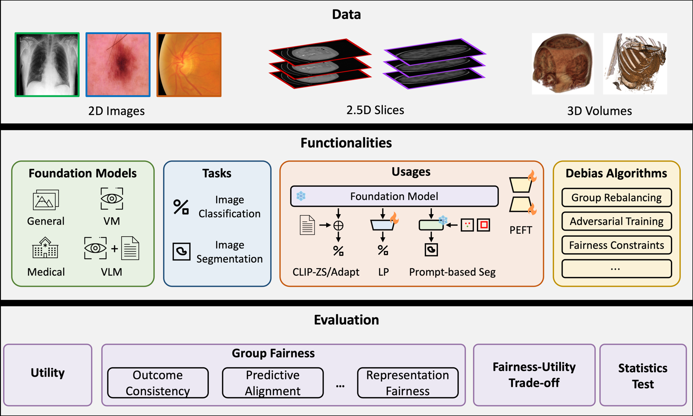

<div class="hero" markdown>

# Fairness evaluation for any classification or segmentation model

<p class="lead">FairMedFM measures how a model's performance differs across groups such as sex, age or race.
Give it per-sample predictions and a sensitive attribute; it reports subgroup AUC, accuracy and calibration gaps,
equalized odds, and Dice disparities. It is also the FairMedFM benchmark of 20 medical imaging foundation models
on 17 datasets.</p>

[Get started](installation.md){ .md-button .md-button--primary }
[Evaluate your model](evaluate-your-model.md){ .md-button }

</div>

```bash
pip install fairmedfm
fairmedfm score --task cls --input predictions.csv --sensitive sex age
```

<div class="grid cards" markdown>

-   **Any model, any domain**

    ---

    Binary classifiers and segmentation models from any framework. Export one row per sample; FairMedFM does not
    need to run your model.

-   **Lightweight**

    ---

    The metrics need only NumPy, pandas and scikit-learn: no PyTorch, no GPU. Python 3.10 to 3.13.

-   **Same numbers as the paper**

    ---

    The metrics are checked against the implementation behind the FairMedFM paper, in continuous integration.

-   **Full benchmark included**

    ---

    `pip install "fairmedfm[cls]"` or `"fairmedfm[seg]"` adds the benchmark runner: linear probing, CLIP
    zero-shot and adaptation, and promptable segmentation with SAM-family models.

</div>

## What it measures

| Task | Metrics |
| --- | --- |
| Binary classification | Overall AUC, accuracy, BCE and ECE; worst-group AUC; AUC, accuracy, BCE and ECE gaps between groups; equal opportunity (TPR gap) and equalized odds |
| Segmentation | Mean Dice; worst and best group Dice and their gap; standard deviation and skewness across groups; equity-scaled Dice |

See [Fairness metrics](metrics.md) for exact definitions.

## Two ways to use FairMedFM

**Evaluate your own model.** Run your model anywhere, save a CSV of probabilities and labels (classification) or
Dice scores (segmentation) with sensitive attributes, and run `fairmedfm score`. See
[Evaluate your model](evaluate-your-model.md).

**Run the benchmark.** Evaluate built-in foundation models such as CLIP, BiomedCLIP, MedCLIP, DINOv2, SigLIP,
RETFound, SAM and MedSAM on medical imaging datasets with `fairmedfm run`. See [Run experiments](benchmark.md).



## Key findings from the FairMedFM benchmark

- **Bias is pervasive**: all evaluated medical foundation models show fairness disparities across sex, race and age.
- **Utility and fairness trade off differently**: the most accurate model is often not the fairest.
- **The dataset matters most**: disparities on a dataset stay similar regardless of the foundation model.
- **Mitigation has limited effect**: existing unfairness mitigation methods give only marginal improvements.

Read the paper: [FairMedFM: Fairness Benchmarking for Medical Imaging Foundation Models](https://arxiv.org/abs/2407.00983).
For capability (rather than fairness) evaluation of medical vision-language models, see the companion benchmark
[MedVLMBench](https://github.com/ubc-tea/MedVLMBench).
